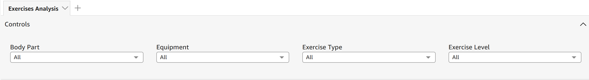
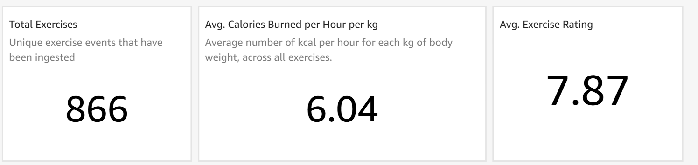
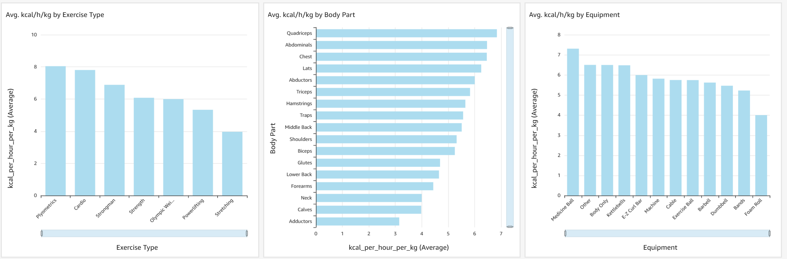
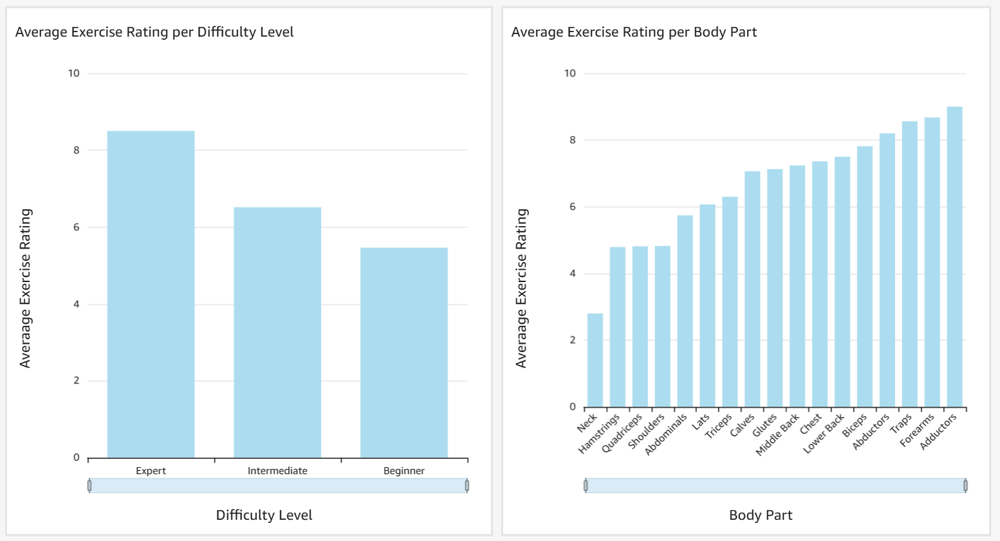

# Hybrid Fitness Data Pipeline – Batch & Streaming

This project demonstrates a full hybrid fitness data pipeline combining real-time streaming (Kafka + MongoDB) with scheduled batch enrichment and loading (Prefect + Redshift). Dashboards are built in Amazon QuickSight to visualize calories burned, difficulty level, and user preferences for each workout.


## 🧠 Project Overview

The pipeline consists of two main workflows:

### 🔄 Real-Time Streaming Pipeline

- **Producer (`producer.py`)**  
  Continuously sends workout messages to Kafka.  
  - Downloads a base exercise CSV and mapping file from Amazon S3  
  - Enriches each record with calories using an external API  
  - Publishes messages (title, duration, weight, calories_aprox, timestamp) 24/7 to a Kafka topic  

- **Consumer (`consumer.py`)**  
  Subscribes to the Kafka topic.  
  - For each message received, it checks for duplicates  
  - Inserts unique records into the `exercises_calories` collection in **MongoDB**

### ⏱️ Batch ETL Pipeline – Prefect

- **Flow (`flow.py`)**  
  Scheduled (e.g., every 10 minutes) to move and enrich data.  
  Steps:
  1. `download_csv_from_s3`: Downloads the latest CSV from S3  
  2. `get_last_timestamp`: (Optional) Queries Redshift for the latest record timestamp  
  3. `extract_from_mongo`: Pulls documents with newer timestamps from MongoDB  
  4. `merge_csv_data`: Combines Mongo data with metadata from the CSV  
  5. `compute_derived_metrics`: Calculates metrics like `kcal_per_minute`, `level_weighted_kcal`, etc.  
  6. `load_to_redshift`: Validates and inserts the final dataset into Redshift  


## 🗺️ Architecture Diagram


## 📊 Dashboard Structure (Amazon QuickSight)

### 1. Filters Panel  
   
📝 **Description:**  
Allows users to filter exercises by:
- Body part
- Equipment
- Type of movement
- Difficulty level  

---

### 2. Key Performance Indicators (KPIs)  
    
📝 **Description:**  
The dashboard highlights:
- Total unique exercises (**866**)  
- Avg. calories burned per hour/kg (**6.04 kcal**)  
- Avg. user rating (**7.87**)

---

### 3. Calories Burned by Category  
    
📝 **Description:**  
Bar charts display average calories burned per hour/kg by:
- Exercise type (e.g., Cardio, Plyometrics)  
- Target body part (e.g., Chest, Quads)  
- Equipment used (e.g., Bodyweight, Kettlebells)

---

### 4. Exercise Ratings by Category  
  
📝 **Description:**  
Shows user ratings based on:
- Difficulty level (Beginner, Intermediate, Expert)  
- Muscle group targeted

## 📂 Key Files

```
/producer/
  └── producer.py

/consumer/
  └── consumer.py

/prefect_flow/
  └── flow.py

/.github/workflows/
  └── ci.yml

/docker-compose.yml

/data/
  └── megaGymDataset.csv

/mapping/
  └── mapping.json
```

## 🧰 Tech Stack

### Languages & Tools
- Python  
- Poetry  

### Streaming & Orchestration
- Apache Kafka  
- Prefect  

### Databases & Storage
- MongoDB  
- Amazon Redshift  
- Amazon S3  

### Infrastructure
- Amazon EC2  
- Docker Compose  

### CI/CD
- GitHub Actions  

### BI & Visualization
- Amazon QuickSight  
